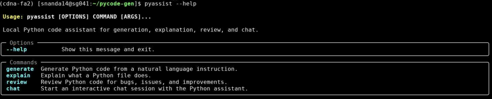
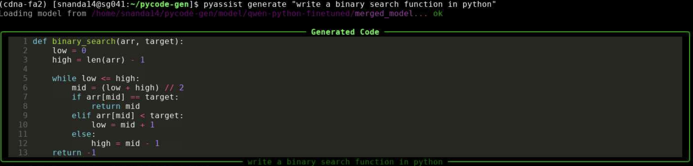
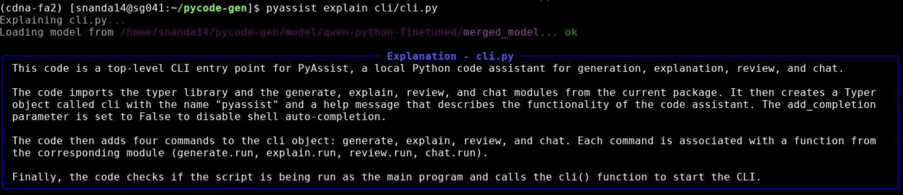
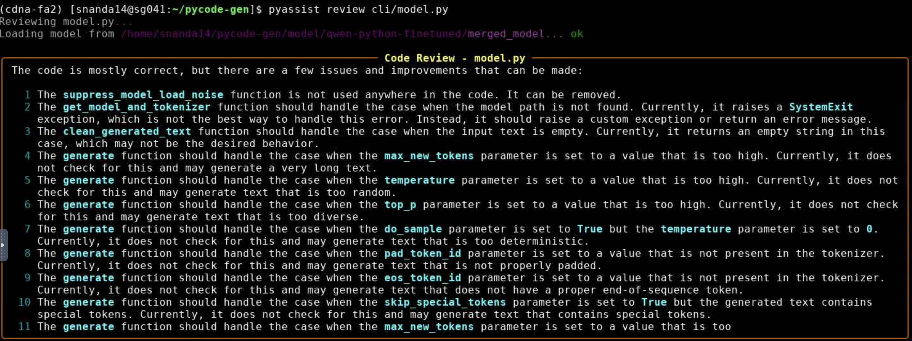
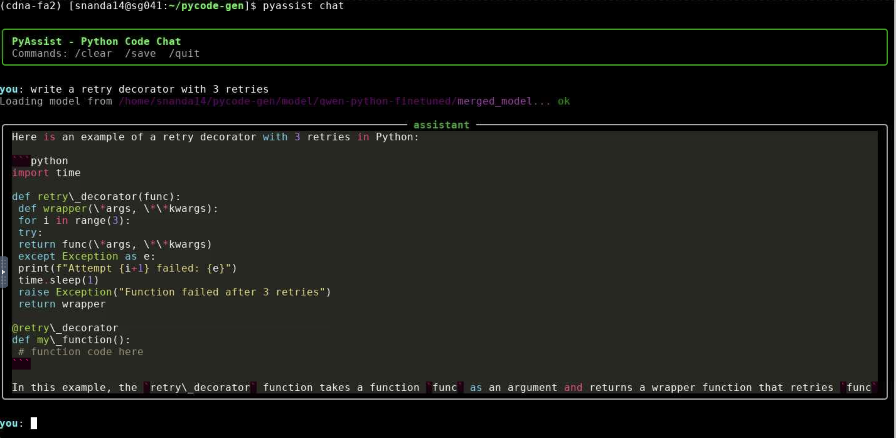

# PyCodeGen

> Fine-tuned **Qwen2.5-Coder-14B-Instruct** on ~84K curated Python samples, improving HumanEval pass@1 from **78.46%** to **85.88%** with LoRA on an A100 80GB GPU.

## Results

| Metric | Baseline | Fine-tuned | Delta |
|--------|----------|------------|-------|
| HumanEval pass@1 | 78.46% | **85.88%** | **+7.42** |
| Problems passed | 131 / 164 | **139 / 164** | +8 |
| Problems fixed | - | 17 | - |
| Problems regressed | - | 9 | - |

```text
Baseline:    78.46%
Fine-tuned:  85.88%
Net gain:    +7.42 points
```

## Overview

This project fine-tunes [Qwen2.5-Coder-14B-Instruct](https://huggingface.co/Qwen/Qwen2.5-Coder-14B-Instruct) for Python code generation. The pipeline covers:

- dataset merging, cleaning, and deduplication across 5 open-source Python datasets
- LoRA fine-tuning with Unsloth and the standard Hugging Face `Trainer`
- HumanEval benchmarking before and after training
- merged-model export for local evaluation and inference
- a local CLI for code generation, explanation, review, and chat

## CLI

The repo includes `pyassist`, a terminal-based Python coding assistant powered by the fine-tuned model.

Commands:

- `pyassist generate` to generate Python code from instructions
- `pyassist explain` to explain Python files or snippets
- `pyassist review` to review code and optionally suggest fixes
- `pyassist chat` for an interactive local coding chat

## CLI Preview

### Help



### Generate



### Explain



### Review



### Chat



## Model Details

| Property | Value |
|----------|-------|
| Base model | Qwen2.5-Coder-14B-Instruct |
| Method | LoRA |
| LoRA config | r=64, alpha=128, dropout=0.0 |
| Target modules | q, k, v, o, gate, up, down projections |
| Precision | bfloat16 |
| Hardware | NVIDIA A100-SXM4-80GB |
| Training run | 1 epoch |
| Training time | ~5 hours |
| Final clean dataset | 84,042 samples |

## Dataset

The training set is built from five open datasets:

| Dataset | Samples | Notes |
|---------|---------|-------|
| [Vezora/Tested-22k-Python-Alpaca](https://huggingface.co/datasets/Vezora/Tested-22k-Python-Alpaca) | 22K | Verified/tested samples |
| [iamtarun/python_code_instructions_18k_alpaca](https://huggingface.co/datasets/iamtarun/python_code_instructions_18k_alpaca) | 18K | General Python instruction tuning |
| [flytech/python-codes-25k](https://huggingface.co/datasets/flytech/python-codes-25k) | 25K | Diverse Python tasks |
| [ise-uiuc/Magicoder-OSS-Instruct-75K](https://huggingface.co/datasets/ise-uiuc/Magicoder-OSS-Instruct-75K) | ~22K | Python-only subset |
| [sahil2801/CodeAlpaca-20k](https://huggingface.co/datasets/sahil2801/CodeAlpaca-20k) | ~8K | Python-filtered subset |

Cleaning steps:

- strip foreign EOS tokens like `<EOS_TOKEN>` and `</s>`
- drop low-signal examples with short prompts or weak code outputs
- keep outputs that look like Python
- deduplicate by normalized instruction prefix

## Project Structure

```text
pycode-gen/
├── cli/
│   ├── cli.py
│   ├── model.py
│   ├── generate.py
│   ├── explain.py
│   ├── review.py
│   ├── chat.py
│   ├── prompts.py
│   └── config.py
├── model/
│   ├── train.py
│   ├── benchmark.py
│   ├── benchmark.log
│   └── benchmark_results/
├── images/
│   ├── help.png
│   ├── generate.png
│   ├── explain.png
│   ├── review.png
│   └── chat.png
├── pyproject.toml
├── requirements.txt
└── README.md
```

## Setup

```bash
git clone https://github.com/DevelopedBy-Siva/pycode-gen
cd pycode-gen

conda create -n pycode-gen python=3.11 -y
conda activate pycode-gen

pip install --upgrade pip
pip install torch==2.11.0 torchvision==0.26.0 --index-url https://download.pytorch.org/whl/cu128
pip install -r requirements.txt
pip install -e .
```

## Training

```bash
python model/train.py
```

Outputs are written to `./model/qwen-python-finetuned/`:

- `lora_adapter/` for the adapter weights
- `merged_model/` for the merged bf16 model

For a small smoke test, set this in `train.py`:

```python
cfg.max_samples = 5000
```

## Evaluation

```bash
# Baseline
python model/benchmark.py --model Qwen/Qwen2.5-Coder-14B-Instruct --label baseline

# Fine-tune
python model/train.py

# Fine-tuned benchmark
python model/benchmark.py --model ./model/qwen-python-finetuned/merged_model --tokenizer Qwen/Qwen2.5-Coder-14B-Instruct --label finetuned

# Compare results
python model/benchmark.py --compare
```

Sample comparison output:

```text
============================================================
HUMANEVAL BENCHMARK COMPARISON
============================================================
Metric                   Baseline   Fine-tuned      Delta
------------------------------------------------------------
pass@1 (%)                  78.46        85.88      +7.42
Problems passed               131          139         +8
Total problems                164          164
============================================================
```

## Prompt Format

Training examples use this format:

```text
### Instruction:
Write a Python function to reverse a linked list

### Response:
def reverse_linked_list(head):
    prev = None
    curr = head
    while curr:
        next_node = curr.next
        curr.next = prev
        prev = curr
        curr = next_node
    return prev<|im_end|>
```

## CLI Usage

```bash
pyassist --help
pyassist generate "write a binary search function in python"
pyassist explain model/train.py
pyassist review cli/model.py
pyassist chat
```

## Notes

- `model/train.py` uses the standard Hugging Face `Trainer`, not `SFTTrainer`, to avoid tokenizer and EOS conflicts in the Unsloth + TRL stack.
- `model/benchmark.py` supports `--tokenizer` because some local merged-model exports can fail tokenizer loading on `transformers==5.5.0`.
- Built with Python `3.11`, PyTorch `2.11`, Transformers `5.5.0`, TRL `1.2.0`, and Unsloth.

## Acknowledgements

- [Unsloth](https://github.com/unslothai/unsloth)
- [Qwen2.5-Coder](https://huggingface.co/Qwen/Qwen2.5-Coder-14B-Instruct)
- [HumanEval](https://github.com/openai/human-eval)
- the authors of the datasets listed above
